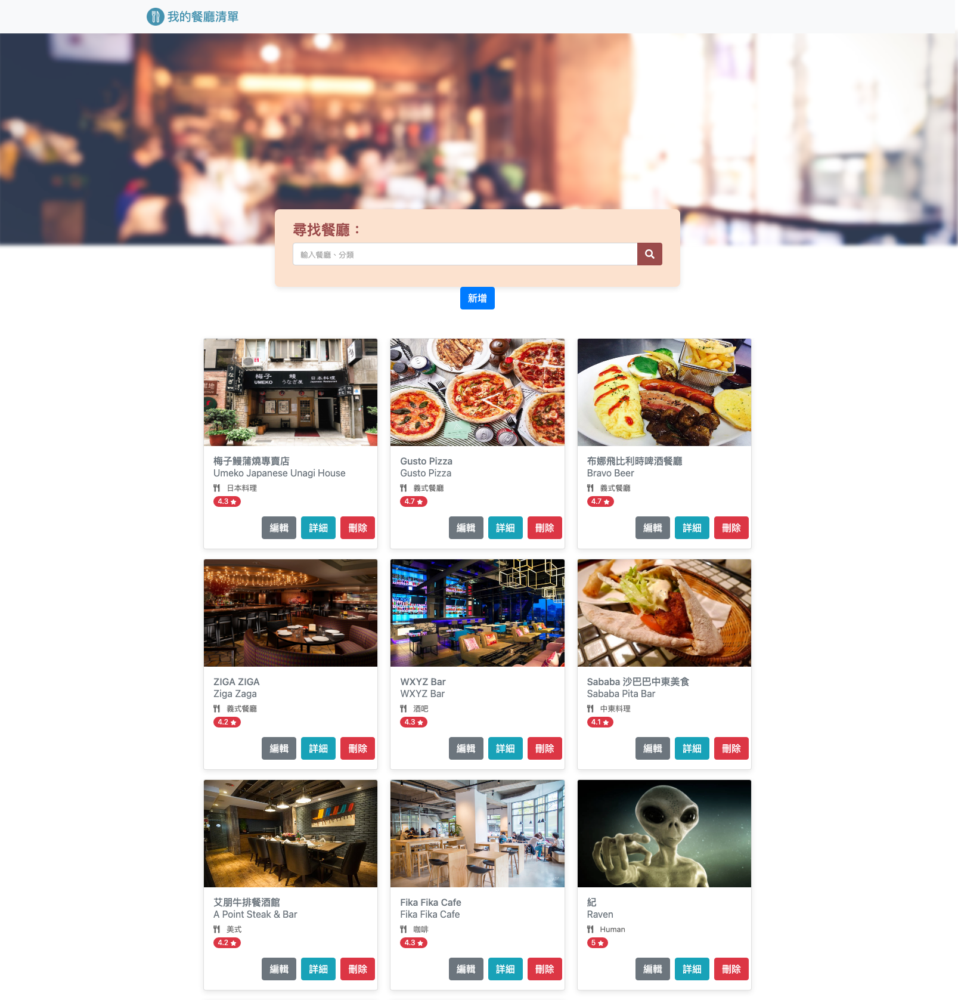
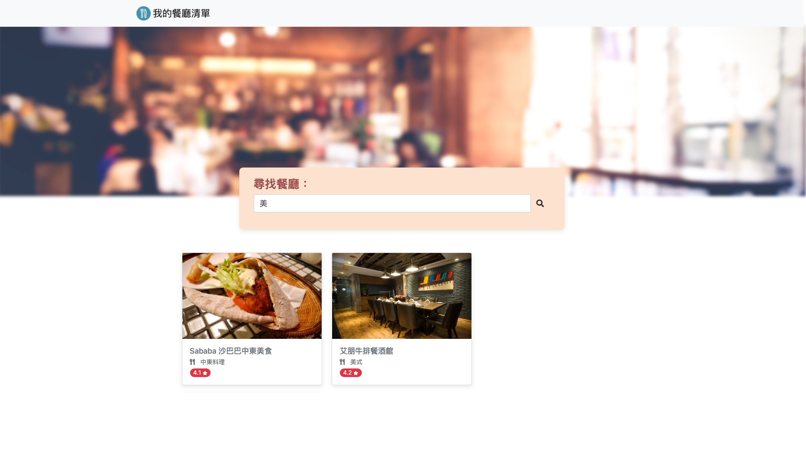

# Restaurant List 餐廳清單

透過 Node.js 和 Express 打造的餐廳資訊網，提供各位吃貨們尋覓台北市的美食佳餚。

## Features 功能

- 使用者可以在首頁看到所有餐廳與它們的簡單資料，包含照片、名稱、分類、評分
- 使用者可以再點進去看餐廳的詳細資訊，包含類別、地址、電話、描述、圖片
- 使用者可以透過搜尋餐廳名稱或類別來找到特定的餐廳

## Preview 畫面預覽





## Installing 安裝

1. 打開終端機 (Terminal) 輸入以下訊息，下載專案至本機

```
git clone https://github.com/ravenera0317/restaurant-list.git
```

2. 進入專案目錄資料夾

```
cd restaurant-list
```

3. 安裝 npm 套件

```
npm install
```

4. 啟動伺服器來執行專案

```
npm run dev
```

5. 出現以下訊息即可打開瀏覽器輸入 http://localhost:3000/ 開始使用

```
Express is listening on localhost:3000
```
